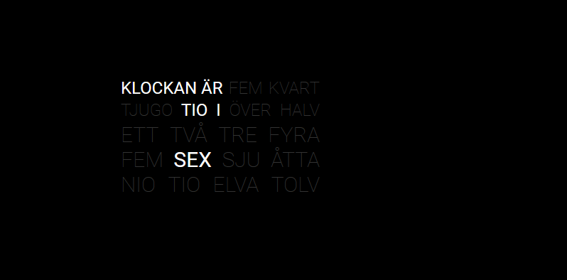

# MMM-TextClock

This module for the [MagicMirror](https://github.com/MichMich/MagicMirror) give you the time in a stylish word styled clock!





## Installation

  1\. Execute the following commands to install the module:

```bash
cd ~/MagicMirror/modules # navigate to module folder
git clone https://github.com/brobergp/MMM-TextClock.git # clone this repository
```

  2\. Then, add the following into the `modules` section of your `config/config.js` file:

````javascript
{
	 module: 'MMM-TextClock',
	 position: 'middle_center',
		config: {
			layout: "Field", //options are "Line" and "Field"
			its24: "HOLY SHIT IS IT", //text before hour
			to24: "BLOODY", //text between hour and minute
			after24: "ALREADY?", //text after minute
			marked: "color: white; font-weight: 400;", //css code to mark current time in Field layout
		}
},
````


## Customization

  Copy the code from the all.css and/or language css to your own custom.css and change whatever you like about the font, color etc.
  To change the style of the marked words on the clock Field you have to add the css code directily in the config file in the "marked" option.

## Language support

	Currently the only Language Field layouts that are supported are English (en) and Swedish (sv).

## Configuration options

The following properties can be configured:

| option | description |
| ------------- | ------------- |
| `timeFormat` | Default timeformat from config, `HH` for 24h or `h` for 12h, don't add this if you want to use the mirror config settings |
| `clang` | If your mirror language isn't supported, add "en" to this option. See Language support above |
| `layout` | What type of layout you want, `Field` or `Line` are the two options |
| `its24` | The text line before hour |
| `to24` | The text line between hour and minute |
| `after24` | The text line after minute |
| `marked`| The css code to define the style of current time on the clock `Field` |
